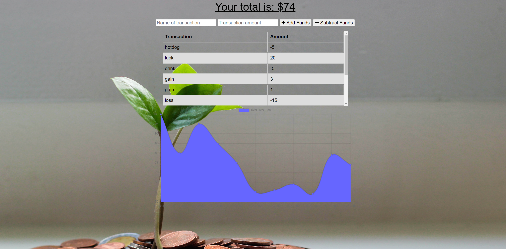

# Budget Anytime
 

Budget Anytime is an existing Budget Tracker application where I have added offline access and functionality. The user will be able to add expenses and deposits to their budget with or without an internet connection. When entering transactions offline, they should still populate the total when brought back online. Giving users a fast and easy way to track their money is important, but allowing them to access that information anytime is even more important. Having offline functionality is paramount to the success of the application.



## Usage
The application will be invoked with the following command:
```
node server.js
```

## Technologies

[Express](https://expressjs.com/) web framework was used to create routes, create route handlers, handle errors, serve static files, as well as use middleware for additional request processing. 

[Compression](https://www.npmjs.com/package/compression) middleware was used to compress the response bodies for all request that transverse through. 

[Lite-Server](https://www.npmjs.com/package/lite-server) functioned as a development only node server that serves a web app, opens it in the browser, refreshes when html or javascript change, injects CSS changes using sockets, and has a fallback page when a route is not found. 

[Mongoose](https://www.npmjs.com/package/mongoose) functioned as a MongoDB object modeling tool designed to work in an asynchronous environment. Mongoose supports both promises and callbacks. 

[Morgan](https://www.npmjs.com/package/morgan) functioned as middleware to log HTTP requests in the console. 

## Credits

A link to the [Budget Anytime](https://sheltered-river-76743.herokuapp.com/) application is deployed on Heroku. 

A link to the [Budget Anytime](https://github.com/nikolaslenning/Budget-Anytime-PWA) repository is hosted on Github.

This application was authored by [Nikolas Lenning](https://github.com/nikolaslenning).
